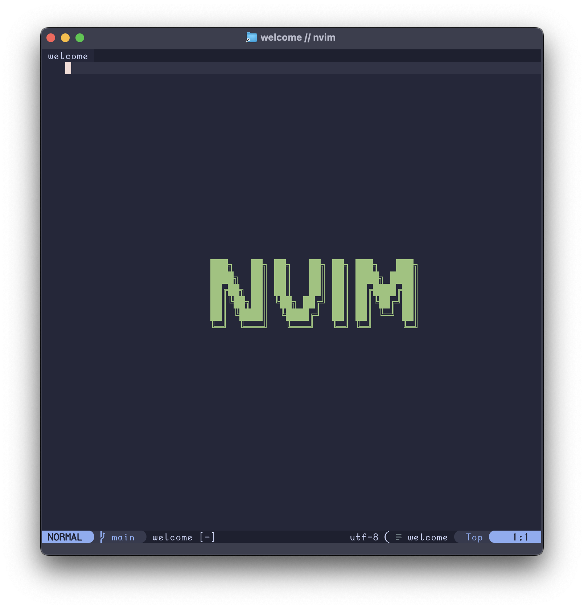
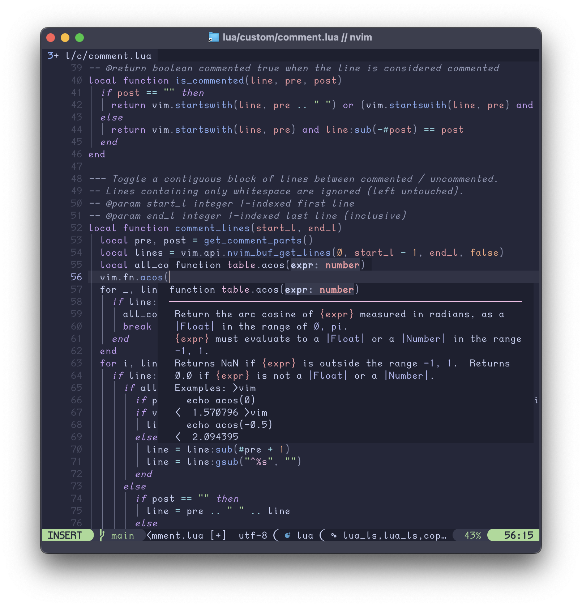

# ✨ Jake’s Neovim — fast, friendly, batteries‑included

[][neovim]
[][macos]
[][lazy]
[][blink]
[][treesitter]
[][dap]
[][ollama]
[](LICENSE)

A lean Neovim setup that stays out of your way while giving you a modern IDE feel. It’s built on [lazy.nvim][lazy] and tuned for Go, Rust, Lua, YAML, Markdown, and general scripting. Thoughtful defaults, a clean UI, and a few bespoke modules (AI prompts, lightweight git signs, code screenshots, etc.) help you get into flow quickly.

Target: Neovim 0.9+ (great on 0.10). Primary platform: macOS (portable elsewhere).


---

## Why use this config?

- Fast startup with on‑demand plugin loading.
- Discoverable keymaps and a friendly UI.
- Strong language tooling without bloat (LSP, completion, debug, sessions).
- Local AI workflows (review, enhance, summarize) that work on selections.
- Sensible custom helpers: Go commands, quick terminal runner, code snapshotting.

---

## What’s inside (high level)

- UI: [Catppuccin][catppuccin], [lualine][lualine], [which‑key][whichkey], [dressing][dressing], [noice][noice] (+[nui][nui], +[notify][notify]), [Symbols Outline][symbols-outline].
- Navigation & search: [Snacks][snacks] pickers (files, grep, buffers, projects, undo). [Oil][oil] for a buffer‑centric file explorer. A tiny `:Find` dispatcher built on Snacks.
- Editing & refactors: [Treesitter][treesitter], [mini.surround][mini], [ssr.nvim][ssr] (structural search/replace), [spread.nvim][spread].
- LSP & tools: [mason.nvim][mason], [mason‑lspconfig][mason-lsp], [nvim‑lspconfig][lspconfig], [SchemaStore][schemastore], [neoconf][neoconf], [lazydev][lazydev], [fidget][fidget], [lspkind][lspkind], sessions via [persistence.nvim](https://github.com/folke/persistence.nvim).
- Completion: [blink.cmp][blink] + [friendly‑snippets][friendly-snippets] (Lua dev extras via [lazydev][lazydev]). Copilot optional via [copilot.lua][copilot].
- Debugging: [nvim‑dap][dap], [dap‑ui][dap-ui], [dap‑go][dap-go], [dap virtual‑text][dap-vt], [nvim‑nio][nio].
- Git: [Neogit][neogit], [vim‑fugitive][fugitive], [diffview][diffview], and a custom lightweight “git signs” module.
- AI (local): custom Ollama integration ([Ollama][ollama]) with streaming UI and selection‑aware transforms.
- Extras: typing practice with [typr][typr].

Custom modules included: welcome screen · comment toggler · freeze (code → image) · git signs · Go commands · terminal runner · virtcolumn.

---

## Quick start

```bash
mkdir -p ~/.config/nvim
cd ~/.config/nvim
git clone https://github.com/jakelogemann/nvim .
nvim
```

First launch bootstraps [lazy.nvim][lazy] and installs plugins.

Recommended system packages: `git`, `ripgrep`, `curl`; language toolchains as needed (`go`, `rustup`, `node`, `python3`). Optional: `ollama` for AI and `freeze` for screenshots.

---

## Everyday usage (a tiny tour)

- Explore files: press `-` (or `<leader>e`) to open [Oil][oil] in the current directory. Open buffers with `⟨leader⟩,`, and your config files with `⟨leader⟩fc`.
- Search with [Snacks][snacks]: smart `⟨leader⟩<space>`, files `⟨leader⟩ff`, grep `⟨leader⟩/`, recent `⟨leader⟩fr`, projects `⟨leader⟩fp`, notifications `⟨leader⟩n`, command history `⟨leader⟩:`.
- Git workflows: `:Neogit` for a full UI; open/close diff view with `⟨leader⟩gd` / `⟨leader⟩gq`.
- Project root: set cwd to the detected project root with `⟨leader⟩pR` (`:RootHere`).
- LSP: rename `⟨leader⟩lr`, code actions `⟨leader⟩la`, hover `K`, diagnostics float `⟨leader⟩ld`.
- Inlay hints: toggle per-buffer with `⟨leader⟩lI` (defaults on; global toggle via `vim.g.inlay_hints_enabled`).
- Diagnostics: toggle per-buffer with `⟨leader⟩zd`.
- Debug: `⟨leader⟩d…` for common actions (continue, step, toggle UI). Quick toggles also on `F1–F5`.
- Comments: toggle with `⟨leader⟩c` (line or visual selection).
- Run current file: `⟨leader⟩xx` (dispatches for Go/Rust/Python/Shell).
- AI prompts: `:Ollama` or `⟨leader⟩o{p|e|c|r|s}` to prompt/enhance/change/review/summarize.
- Plugin management: `⟨leader⟩Vl` Lazy UI, `⟨leader⟩Vs` sync, `⟨leader⟩Vu` update, `⟨leader⟩Vp` profile, `⟨leader⟩Vm` Mason UI, `⟨leader⟩Vi` edit `init.lua`, `⟨leader⟩VM` open mason.log.
- Health checks: `⟨leader⟩Vh` runs `:checkhealth custom`.
- Terminals: `⟨leader⟩Tt` toggle a floating terminal (ToggleTerm), `⟨leader⟩Tn` open a new terminal (Snacks).
- Project config & sessions: `⟨leader⟩pc` Neoconf UI. Sessions: `⟨leader⟩Sl` load, `⟨leader⟩SL` load last, `⟨leader⟩Ss` select, `⟨leader⟩Sd` stop saving.

Tip: press `⟨leader⟩` to discover groups via [which‑key][whichkey].

---

## Keymap Quick Reference

Find / Search (Snacks)
- Smart: `⟨leader⟩<space>`
- Files: `⟨leader⟩ff` · Git files: `⟨leader⟩fg` · Config files: `⟨leader⟩fc`
- Grep: `⟨leader⟩/` · Recent: `⟨leader⟩fr` · Projects: `⟨leader⟩fp`
- Buffers: `⟨leader⟩,` · Notifications: `⟨leader⟩n` · Cmd history: `⟨leader⟩:`

LSP (buffer‑local)
- Definition: `gd` · Declaration: `gD` · References: `gr` · Implementation: `gI`
- Rename: `⟨localleader⟩rn` · Code action: `⟨localleader⟩ca` · Hover: `K`
- Doc symbols: `⟨localleader⟩ds` · Workspace symbols: `⟨localleader⟩ws`
- Diagnostics: float `⟨leader⟩ld` · Prev/Next `[d`/`]d`
- Inlay hints toggle: `⟨leader⟩lI` · Format: `:Format` or `⟨leader⟩lf`

Git
- Neogit UI: `:Neogit` · Diff view open/close: `⟨leader⟩gd`/`⟨leader⟩gq` · Signs toggle: `⟨leader⟩zg`

Terminals
- ToggleTerm float: `⟨leader⟩Tt` · New Snacks terminal: `⟨leader⟩Tn`

Misc
- Oil explorer: `-` or `⟨leader⟩e` · Run current file: `⟨leader⟩xx` · Comment toggle: `⟨leader⟩c`

---

## Language tooling

LSP servers are installed and configured through [mason.nvim][mason] and [mason‑lspconfig][mason-lsp] with [nvim‑lspconfig][lspconfig]. YAML schemas are pre‑mapped via [SchemaStore][schemastore]. Inlay hints are enabled when the server supports them. `:Format` is available per buffer.

Completion is powered by [blink.cmp][blink] with snippet support from [friendly‑snippets][friendly-snippets]. Lua development gains typed completions via [lazydev][lazydev]. Copilot can be toggled with `:Copilot enable|disable` if desired.

Debugging is ready out of the box with [nvim‑dap][dap], UI via [dap‑ui][dap-ui], Go helpers via [dap‑go][dap-go], and inline values from [nvim‑dap‑virtual‑text][dap-vt] (with simple secret‑redaction).

---

## Local AI (Ollama)

Use `:Ollama` to pick a prompt or the `⟨leader⟩o…` shortcuts. Works on a visual selection or whole file. Streaming output appears in a floating window with accept (`Ctrl‑Enter`), retry (`Ctrl‑R`), and quit (`q`). For best results, run the Ollama daemon (`ollama serve`). The integration will try to start it if not running.

---

## Code screenshots (Freeze)

Install the `freeze` CLI to render pretty images of code:

- `:Freeze` — snapshot the whole buffer or a visual range (`:'<,'>Freeze`).
- `:FreezeLine` — snapshot the current line.

File names are templated (timestamp, filename, start/end lines) and can auto‑open on macOS.

---

## Sessions (persistence.nvim)

Sessions are lightweight and branch‑aware by default. The session options are tuned for reliability (saving window sizes/positions, folds, terminals, and the current working directory).

- Load session: `⟨leader⟩Sl`
- Load last session: `⟨leader⟩SL`
- Select session: `⟨leader⟩Ss`
- Stop saving in this workspace: `⟨leader⟩Sd`

### Notes

- Sessions are saved only when at least one file buffer is open (need = 1).
- Storage location: `:echo stdpath('state') .. '/sessions'`.
- Session saving is paused when you run `:PersistenceStop`.


---

## Minimal git signs

A tiny built‑in module draws `+` additions, `~` changes, and `-` deletions with smart placement. It’s fast, debounced, and safe on large files. Toggle with `:GitSignsToggle` or `⟨leader⟩zg`. Switch diff base between `HEAD` and staged with `:GitSignsDiffTarget [head|staged]`.

---

## Options & layout

Notable choices (see `plugin/options.lua`): modern command line (`cmdheight=0`), global statusline, conceal by default (toggle `⟨leader⟩zc`), persistent undo, and sane splits. Toggle format‑on‑save with `⟨leader⟩zf` (global), or `:FormatToggle` (global) / `:FormatToggle!` (buffer). Run `:Format` on demand. Nerd Font icons are expected.

Project structure at a glance:

```text
init.lua                — bootstrap lazy + core modules
lua/custom/plugins/     — plugin specs (UI, LSP, cmp, tools, etc.)
plugin/*.lua            — runtime config and custom features (auto‑sourced)
lua/custom/*.lua        — bespoke modules (comment, utils)
lua/freeze.lua          — freeze CLI wrapper
spell/                  — spelling & thesaurus
```

---

## Troubleshooting

- Missing syntax or LSP? Open `:Mason` and ensure tools are installed.
- No AI responses? Verify `ollama serve` and a model are available.
- Git signs missing? Make sure you’re inside a git repo and the file is tracked.
- Startup slower than expected? Temporarily enable profiling (if the optional profiler is present).
- Sessions not saving? Ensure at least one file buffer is open. You can temporarily disable saving with `⟨leader⟩Sd`.

### Formatting with Conform

- :Format prefers external formatters via conform.nvim and falls back to LSP when none are configured for a filetype. If a configured formatter runs and fails, Conform reports an error (it will not fall back after a hard failure).
- Common tools used here: stylua, shfmt, jq, yamlfmt, prettier, rustfmt, gofumpt, goimports, eslint_d, shellcheck, luacheck, markdownlint, golangci-lint.
- Install examples (macOS):
  - brew install stylua shfmt jq yamlfmt shellcheck luacheck golangci-lint gofumpt
  - npm i -g prettier eslint_d markdownlint-cli
  - rustup component add rustfmt
  - go install golang.org/x/tools/cmd/goimports@latest
- If you see “Client stylua quit with exit code 2”, run the tool directly on the file to inspect the error: `stylua path/to/file.lua`. Also check `:messages` and `~/.local/state/nvim/lsp.log`.

### LSP deprecation warnings

- Message: `vim.lsp.get_active_clients() is deprecated` typically comes from a plugin. Run `:checkhealth vim.deprecated` to see more details and update the offending plugin. This config already uses `vim.lsp.get_clients()` and newer APIs.

### Verification & CI tips

- See AGENTS.md for comprehensive, offline‑first verification guidance.
- Local headless runs:
  - `nvim --headless "+Lazy check" +qa`
  - `nvim --headless "+Lazy sync" +qa`
  - `nvim --headless "+checkhealth" +qa`
  - `nvim --headless "+checkhealth custom" +qa`
- Sandbox/CI (no writes to `~`):
  - `XDG_CACHE_HOME="$PWD/.nvimcache" XDG_STATE_HOME="$PWD/.nvimstate" XDG_DATA_HOME="$PWD/.nvimdata" nvim --headless "+Lazy check" +qa`
  - Set `NVIM_TS_PARSER_DIR="$PWD/.nvimparsers"` if Treesitter parser writes are blocked.
  - Or use the provided mise tasks:
    - `mise run verify` (runs Lazy check/sync and health checks with safe env)
    - `mise run clean_cache` to remove local XDG dirs created for headless runs
  
### Commit messages

- This repo uses Conventional Commits (see AGENTS.md for a template and examples).


---

## Screenshots


_Welcome Screen_.


_Completion via [blink]._


_Inline documentation_.

---

## License

Custom Lua in this repo is MIT unless noted. Each third‑party plugin remains under its own license.

---

[neovim]: https://neovim.io
[macos]: https://www.apple.com/macos
[lazy]: https://github.com/folke/lazy.nvim
[catppuccin]: https://github.com/catppuccin/nvim
[whichkey]: https://github.com/folke/which-key.nvim
[dressing]: https://github.com/stevearc/dressing.nvim
[noice]: https://github.com/folke/noice.nvim
[nui]: https://github.com/MunifTanjim/nui.nvim
[notify]: https://github.com/rcarriga/nvim-notify
[lualine]: https://github.com/nvim-lualine/lualine.nvim
[symbols-outline]: https://github.com/simrat39/symbols-outline.nvim
[snacks]: https://github.com/folke/snacks.nvim
[oil]: https://github.com/stevearc/oil.nvim
[treesitter]: https://github.com/nvim-treesitter/nvim-treesitter
[mini]: https://github.com/echasnovski/mini.nvim
[ssr]: https://github.com/cshuaimin/ssr.nvim
[spread]: https://github.com/aarondiel/spread.nvim
[mason]: https://github.com/williamboman/mason.nvim
[mason-lsp]: https://github.com/williamboman/mason-lspconfig.nvim
[lspconfig]: https://github.com/neovim/nvim-lspconfig
[schemastore]: https://github.com/b0o/SchemaStore.nvim
[neoconf]: https://github.com/folke/neoconf.nvim
[lazydev]: https://github.com/folke/lazydev.nvim
[fidget]: https://github.com/j-hui/fidget.nvim
[lspkind]: https://github.com/onsails/lspkind.nvim
[blink]: https://github.com/saghen/blink.cmp
[friendly-snippets]: https://github.com/rafamadriz/friendly-snippets
[copilot]: https://github.com/zbirenbaum/copilot.lua
[dap]: https://github.com/mfussenegger/nvim-dap
[dap-ui]: https://github.com/rcarriga/nvim-dap-ui
[dap-go]: https://github.com/leoluz/nvim-dap-go
[dap-vt]: https://github.com/theHamsta/nvim-dap-virtual-text
[nio]: https://github.com/nvim-neotest/nvim-nio
[neogit]: https://github.com/TimUntersberger/neogit
[fugitive]: https://github.com/tpope/vim-fugitive
[diffview]: https://github.com/sindrets/diffview.nvim
[typr]: https://github.com/nvzone/typr
[ollama]: https://github.com/ollama/ollama

Happy hacking! 🛠️
